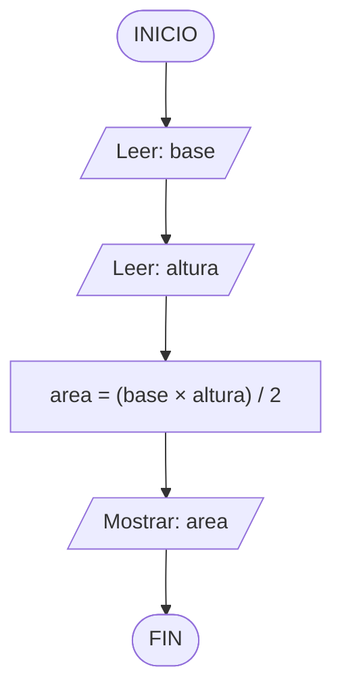
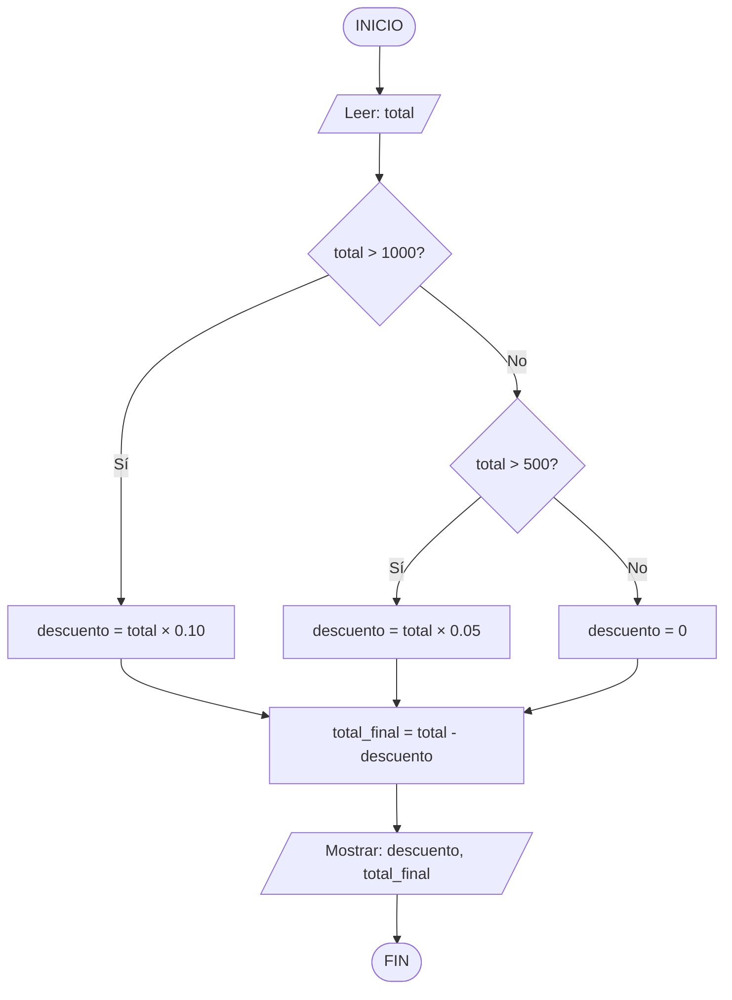
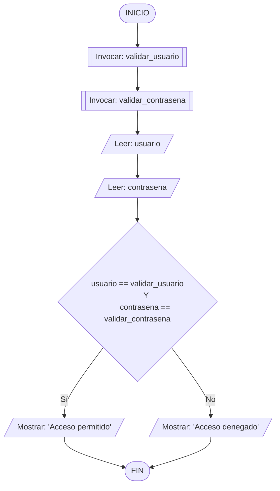
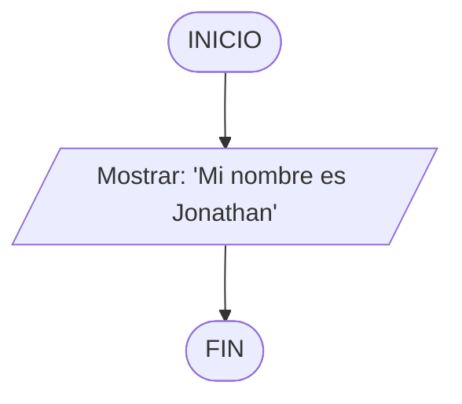
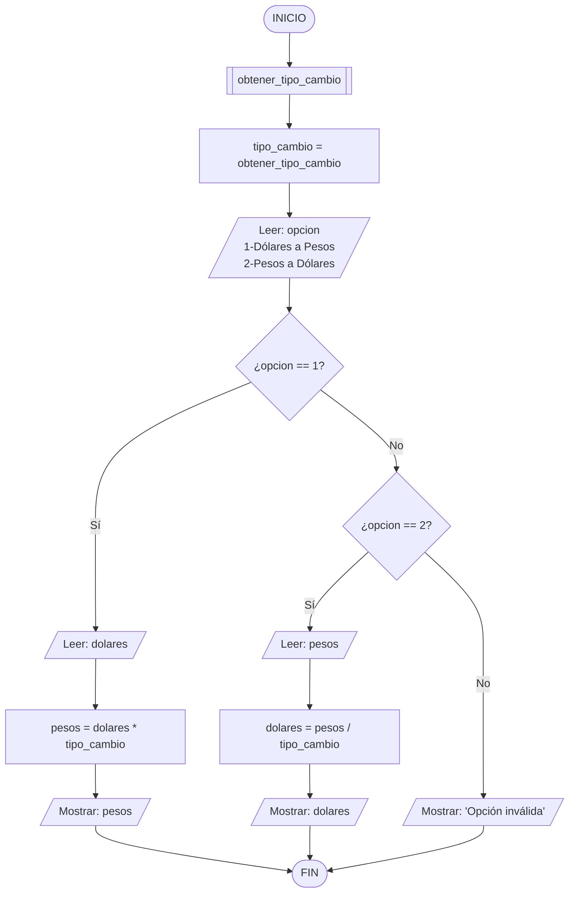
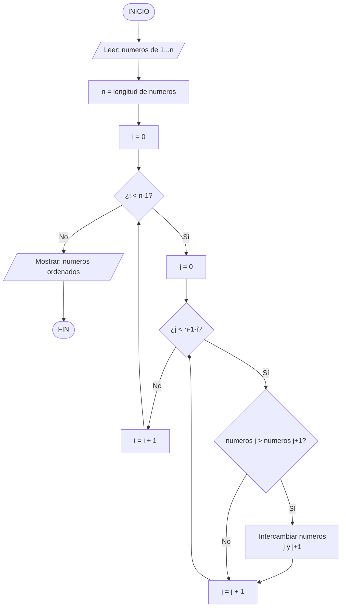

# Ejercicios Actividad 3

## Diagramas de flujo

### 1. Calcular el área de un triángulo.

####

Lenguaje Natural

1. Solicitar la base del triángulo
2. Solicitar la altura del triángulo
3. Calcular el área con la fórmula: (base × altura) / 2
4. Mostrar el resultado

#### Pseudocódigo

```
INICIO
  LEER base
  LEER altura
  area = (base * altura) / 2
  ESCRIBIR "El área es: ", area
FIN
```

#### Diagrama de flujo en Mermaid



#### Diagrama de flujo


### 2. Aplicando descuentos:

- Si el total de la venta es mayor a 1000, aplicar un descuento del 10%.
- Si el total de una venta es mayor a 500, aplicar un descuento del 5%.
- Si es menor, no aplicar descuento.

#### Lenguaje Natural

1. Solicitar el total de la venta
2. Revisar si el total es mayor a 1000 → aplicar 10% de descuento
3. Si no, revisar si el total es mayor a 500 → aplicar 5% de descuento
4. Si ninguna condición se cumple → no aplicar descuento
5. Calcular el total final restando el descuento
6. Mostrar el descuento aplicado y el total final

#### Pseudocódigo

```
INICIO
  LEER total

  SI total > 1000 ENTONCES
    descuento = total * 0.10
  SINO SI total > 500 ENTONCES
    descuento = total * 0.05
  SINO
    descuento = 0
  FIN SI

  total_final = total - descuento
  ESCRIBIR "Descuento: ", descuento
  ESCRIBIR "Total final: ", total_final
FIN
```

#### Diagrama de Flujo



#### Diagrama de flujo


### 3. Sistema de acceso:

- Si usuario y contraseña son correctos → Acceso permitido
- Si no → Acceso denegado

#### Lenguaje Natural

1. Solicitar el nombre de usuario
2. Solicitar la contraseña
3. Comparar usuario y contraseña con los valores correctos almacenados
4. Si ambos son correctos → mostrar "Acceso permitido"
5. Si alguno es incorrecto → mostrar "Acceso denegado"

#### Pseudocódigo

```
INICIO
  INVOCAR validar_usuario
  INVOCAR validar_contrasena

  LEER usuario
  LEER contrasena

  SI usuario == validar_usuario Y contrasena == validar_contrasena ENTONCES
    ESCRIBIR "Acceso permitido"
  SINO
    ESCRIBIR "Acceso denegado"
  FIN SI
FIN
```

## Diagrama de Flujo



#### Diagrama de flujo


## Código de programación

### 1. Escribe un programa que muestre tu nombre en pantalla.

#### Pseudocódigo

```
INICIO
  ESCRIBIR "Mi nombre es Jonathan"
FIN
```

#### Diagrama de flujo en Mermaid



#### Diagrama de flujo


#### JavaScript

```javascript
console.log("Mi nombre es Jonathan");
```

#### Python

```python
print("Mi nombre es Jonathan")
```

#### C#

```csharp
using System;
class Program {
    static void Main() {
        Console.WriteLine("Mi nombre es Jonathan");
    }
}
```

#### Java

```java
public class Main {
    public static void main(String[] args) {
        System.out.println("Mi nombre es Jonathan");
    }
}
```

### 2. Crear un programa que convierta dolares a pesos mexicanos y viceversa.

#### Pseudocódigo

```
INICIO
  INVOCAR obtener_tipo_cambio
  tipo_cambio = obtener_tipo_cambio
  ESCRIBIR opcion "1. Dólares a Pesos  2. Pesos a Dólares"
  LEER opcion
  SI opcion == 1 ENTONCES
    LEER dolares
    pesos = dolares * tipo_cambio
    ESCRIBIR "Resultado: ", pesos, " MXN"
  SINO SI opcion == 2 ENTONCES
    LEER pesos
    dolares = pesos / tipo_cambio
    ESCRIBIR "Resultado: ", dolares, " USD"
  SINO
    ESCRIBIR "Opción inválida"
  FIN SI
FIN
```

#### Diagrama de flujo en Mermaid



#### Diagrama de flujo


#### JavaScript

```javascript
const TIPO_CAMBIO = 17.5;

let opcion = prompt(
  `Elige opción:\n    1. Dólares → Pesos.\n    2. Pesos → Dólares.`,
);

if (opcion === "1") {
  let dolares = prompt("Ingresa dólares:");
  alert(`Resultado: ${(parseFloat(dolares) * TIPO_CAMBIO).toFixed(2)} MXN`);
} else if (opcion === "2") {
  let pesos = prompt("Ingresa pesos:");
  alert(`Resultado: ${(parseFloat(pesos) / TIPO_CAMBIO).toFixed(2)} USD`);
} else {
  alert("Opción inválida");
}
```

#### Python

```python
TIPO_CAMBIO = 17.50

opcion = input("1. Dólares → Pesos  2. Pesos → Dólares\nElige opción: ")

if opcion == "1":
    dolares = float(input("Ingresa dólares: "))
    print(f"Resultado: {dolares * TIPO_CAMBIO:.2f} MXN")
elif opcion == "2":
    pesos = float(input("Ingresa pesos: "))
    print(f"Resultado: {pesos / TIPO_CAMBIO:.2f} USD")
else:
    print("Opción inválida")
```

#### Java

```java
import java.util.Scanner;
public class Main {
    public static void main(String[] args) {
        Scanner sc = new Scanner(System.in);
        double tipoCambio = 17.50;
        System.out.println("1. Dólares → Pesos  2. Pesos → Dólares");
        String opcion = sc.nextLine();

        if (opcion.equals("1")) {
            System.out.print("Ingresa dólares: ");
            double dolares = sc.nextDouble();
            System.out.printf("Resultado: %.2f MXN%n", dolares * tipoCambio);
        } else if (opcion.equals("2")) {
            System.out.print("Ingresa pesos: ");
            double pesos = sc.nextDouble();
            System.out.printf("Resultado: %.2f USD%n", pesos / tipoCambio);
        } else {
            System.out.println("Opción inválida");
        }
    }
}
```

### 3. Crear un programa que dado un conjunto de números los ordene de menor a mayor.

_Bubble Sort_ es un algoritmo de ordenamiento que compara elementos adyacentes e intercambia si el de la izquierda es mayor que el de la derecha.

#### Pseudocódigo

```
INICIO
  LEER numeros[1...n]
  n = longitud de numeros
  PARA i = 0 HASTA i < n-1 HACER
    PARA j = 0 HASTA j < n-1-i HACER
      SI numeros[j] > numeros[j+1] ENTONCES
        Intercambiar numeros[j] y numeros[j+1]
      FIN SI
    FIN PARA
  FIN PARA
  ESCRIBIR numeros ordenados
FIN
```

#### Diagrama de flujo en Mermaid



#### Diagrama de flujo


#### JavaScript

```javascript
function bubbleSort(arr) {
  let n = arr.length;
  for (let i = 0; i < n - 1; i++) {
    for (let j = 0; j < n - 1 - i; j++) {
      if (arr[j] > arr[j + 1]) {
        let temp = arr[j];
        arr[j] = arr[j + 1];
        arr[j + 1] = temp;
      }
    }
  }
  return arr;
}

const numeros = [5, 3, 8, 1, 9, 2];
console.log("Ordenados:", bubbleSort(numeros));
```

#### Python

```python
def bubble_sort(arr):
    n = len(arr)
    for i in range(n - 1):
        for j in range(n - 1 - i):
            if arr[j] > arr[j + 1]:
                arr[j], arr[j + 1] = arr[j + 1], arr[j]
    return arr

numeros = [5, 3, 8, 1, 9, 2]
print("Ordenados:", bubble_sort(numeros))
```

#### Java

```java
import java.util.Arrays;
public class Main {
    static void bubbleSort(int[] arr) {
        int n = arr.length;
        for (int i = 0; i < n - 1; i++) {
            for (int j = 0; j < n - 1 - i; j++) {
                if (arr[j] > arr[j + 1]) {
                    int temp = arr[j];
                    arr[j] = arr[j + 1];
                    arr[j + 1] = temp;
                }
            }
        }
    }

    public static void main(String[] args) {
        int[] numeros = {5, 3, 8, 1, 9, 2};
        bubbleSort(numeros);
        System.out.println("Ordenados: " + Arrays.toString(numeros));
    }
}
```

#### Prueba de escritorio

| Pasada (`i`) | Límite de `j` ($n-1-i$) | `j` | Comparación | `arr[j] > arr[j+1]` | `temp` | Acción      | Estado del Arreglo   |
| ------------ | ----------------------- | --- | ----------- | ------------------- | ------ | ----------- | -------------------- |
| **0**        | **5**                   | 0   | 5 > 3       | Sí                  | 5      | Intercambio | `[3, 5, 8, 1, 9, 2]` |
|              |                         | 1   | 5 > 8       | No                  | -      | -           | `[3, 5, 8, 1, 9, 2]` |
|              |                         | 2   | 8 > 1       | Sí                  | 8      | Intercambio | `[3, 5, 1, 8, 9, 2]` |
|              |                         | 3   | 8 > 9       | No                  | -      | -           | `[3, 5, 1, 8, 9, 2]` |
|              |                         | 4   | 9 > 2       | Sí                  | 9      | Intercambio | `[3, 5, 1, 8, 2, 9]` |
| **1**        | **4**                   | 0   | 3 > 5       | No                  | -      | -           | `[3, 5, 1, 8, 2, 9]` |
|              |                         | 1   | 5 > 1       | Sí                  | 5      | Intercambio | `[3, 1, 5, 8, 2, 9]` |
|              |                         | 2   | 5 > 8       | No                  | -      | -           | `[3, 1, 5, 8, 2, 9]` |
|              |                         | 3   | 8 > 2       | Sí                  | 8      | Intercambio | `[3, 1, 5, 2, 8, 9]` |
| **2**        | **3**                   | 0   | 3 > 1       | Sí                  | 3      | Intercambio | `[1, 3, 5, 2, 8, 9]` |
|              |                         | 1   | 3 > 5       | No                  | -      | -           | `[1, 3, 5, 2, 8, 9]` |
|              |                         | 2   | 5 > 2       | Sí                  | 5      | Intercambio | `[1, 3, 2, 5, 8, 9]` |
| **3**        | **2**                   | 0   | 1 > 3       | No                  | -      | -           | `[1, 3, 2, 5, 8, 9]` |
|              |                         | 1   | 3 > 2       | Sí                  | 3      | Intercambio | `[1, 2, 3, 5, 8, 9]` |
| **4**        | **1**                   | 0   | 1 > 2       | No                  | -      | -           | `[1, 2, 3, 5, 8, 9]` |
