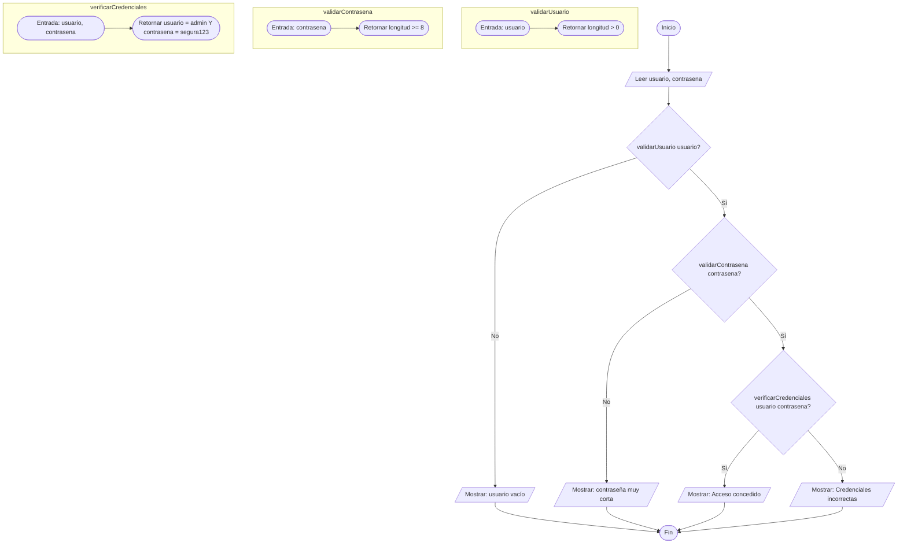
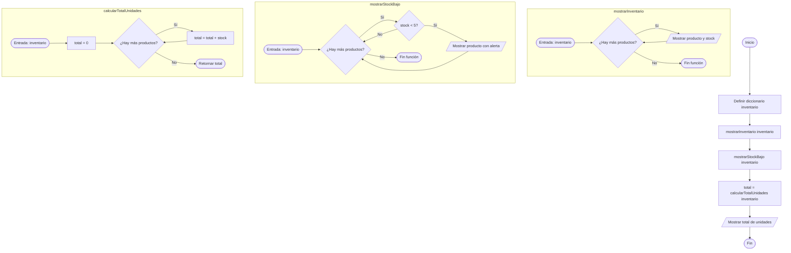

## Tercer Examen Parcial Respuestas Versión B

### Parte Teórica (40%)

#### 1. Modularidad en programación

**Elementos que debe incluir:**

- **Definición:** principio de dividir un programa en partes independientes, cada una con una responsabilidad clara, que pueden desarrollarse, probarse y mantenerse por separado.
- **Tres ventajas:**
  1. Más fácil de entender: se razona parte por parte sin tener en mente el sistema completo.
  2. Más fácil de mantener: un cambio en un módulo no afecta a los demás si las interfaces están bien definidas.
  3. Más fácil de escalar: se agregan módulos sin reescribir los existentes.
- **Ejemplo de organización en módulos:** se espera que el alumno describa un programa real (registro de usuarios, tienda en línea, sistema de notas) e identifique módulos como: validación, cálculo, almacenamiento y presentación, explicando la responsabilidad de cada uno.

---

#### 2. Lista, conjunto y diccionario

**Elementos que debe incluir:**

- **Lista:** colección ordenada de elementos accesibles por posición (índice). Los elementos pueden repetirse. Se usa cuando el orden importa y se necesita acceso posicional. Ejemplo: historial de compras, calificaciones de un estudiante.
- **Conjunto:** colección de elementos únicos sin orden definido. Se usa cuando lo que importa es saber si un elemento pertenece o no, y se requiere que no haya duplicados. Ejemplo: etiquetas de un artículo, correos registrados en un sistema.
- **Diccionario:** colección de pares clave-valor. Se accede a los datos por su clave, no por posición. Se usa cuando los datos tienen un identificador natural. Ejemplo: configuración de una aplicación, datos de un usuario (nombre, edad, correo).

---

#### 3. Pila vs cola

**Elementos que debe incluir:**

- **Pila (LIFO — Last In, First Out):** el último elemento en entrar es el primero en salir. Opera por la cima: se apila y se desapila desde el mismo extremo.
- **Cola (FIFO — First In, First Out):** el primer elemento en entrar es el primero en salir. Los elementos entran por el final y salen por el frente.
- **Diferencia clave:** la pila invierte el orden de llegada; la cola lo respeta.

**Ejemplos esperados:**

- Pila: historial de navegación ("atrás" deshace la última página visitada); deshacer/rehacer en un editor de texto.
- Cola: sistema de atención al cliente (el primero en llegar es el primero en ser atendido); impresión de documentos en orden de envío.

---

#### 4. Clase, objeto, atributo y método en POO

**Elementos que debe incluir:**

- **Clase:** plantilla o molde que define la estructura y el comportamiento de los objetos. No almacena datos por sí misma.
- **Objeto:** instancia concreta de una clase. Es quien ocupa memoria y tiene valores propios.
- **Atributo:** dato que almacena el estado de un objeto (nombre, edad, precio).
- **Método:** función definida dentro de la clase que representa el comportamiento del objeto y opera sobre sus atributos.
- **Diferencia clase/objeto:** la clase es la definición (molde); el objeto es la instancia real creada a partir de ella.

**Ejemplo esperado:**

```
CLASE Producto
  CONSTRUCTOR(nombre, precio)
    this.nombre = nombre
    this.precio = precio
  FIN CONSTRUCTOR

  MÉTODO mostrarInfo()
    MOSTRAR this.nombre, " - $", this.precio
  FIN MÉTODO
FIN CLASE

p1 = nueva Producto("Teclado", 850)
p2 = nueva Producto("Mouse", 350)

p1.mostrarInfo()    ← Teclado - $850
p2.mostrarInfo()    ← Mouse - $350
```

---

### Parte Práctica (60%)

#### Ejercicio 1 — Validador de acceso modular

##### Pseudocódigo (modelo esperado)

```
CONSTANTE USUARIO_VALIDO = "admin"
CONSTANTE CONTRASENA_VALIDA = "segura123"

// Función 1: valida que el usuario no esté vacío
FUNCIÓN validarUsuario(usuario)
  RETORNAR longitud(usuario) > 0
FIN FUNCIÓN

// Función 2: valida que la contraseña tenga al menos 8 caracteres
FUNCIÓN validarContrasena(contrasena)
  RETORNAR longitud(contrasena) >= 8
FIN FUNCIÓN

// Función 3: verifica si las credenciales son correctas
FUNCIÓN verificarCredenciales(usuario, contrasena)
  RETORNAR usuario = USUARIO_VALIDO Y contrasena = CONTRASENA_VALIDA
FIN FUNCIÓN

// Programa principal
Inicio
  Leer usuario
  Leer contrasena

  Si NO validarUsuario(usuario) Entonces
     Mostrar "Error: el nombre de usuario no puede estar vacío"
  Sino Si NO validarContrasena(contrasena) Entonces
     Mostrar "Error: la contraseña debe tener al menos 8 caracteres"
  Sino Si verificarCredenciales(usuario, contrasena) Entonces
     Mostrar "Acceso concedido"
  Sino
     Mostrar "Error: credenciales incorrectas"
  FinSi
Fin
```

##### Diagrama de flujo (modelo esperado)



---

#### Ejercicio 2 — Sistema de inventario con diccionario

##### Pseudocódigo (modelo esperado)

```
// Función 1: muestra todos los productos y su stock
FUNCIÓN mostrarInventario(inventario)
  Mostrar "=== INVENTARIO ==="
  PARA CADA producto, stock EN inventario HACER
    Mostrar producto, ": ", stock, " unidades"
  FIN PARA
FIN FUNCIÓN

// Función 2: muestra productos con stock bajo
FUNCIÓN mostrarStockBajo(inventario)
  Mostrar "=== STOCK BAJO (< 5 unidades) ==="
  PARA CADA producto, stock EN inventario HACER
    SI stock < 5 Entonces
       Mostrar "! ", producto, ": ", stock, " unidades"
    FinSi
  FIN PARA
FIN FUNCIÓN

// Función 3: calcula el total de unidades
FUNCIÓN calcularTotalUnidades(inventario)
  total = 0
  PARA CADA producto, stock EN inventario HACER
    total = total + stock
  FIN PARA
  RETORNAR total
FIN FUNCIÓN

// Programa principal
Inicio
  inventario = {
    "Teclado":     12,
    "Monitor":      3,
    "Mouse":        2,
    "Auriculares":  4,
    "Webcam":       8
  }

  mostrarInventario(inventario)
  mostrarStockBajo(inventario)

  total = calcularTotalUnidades(inventario)
  Mostrar "Total de unidades en inventario: ", total
Fin
```

##### Diagrama de flujo (modelo esperado)


